#  <span style="color: #2F6F3E;">THE REPTILE ZOO</span> 🦎🐍🐊

A full-stack web app for Reptile Zoo visitors and staff to browse animals and events, book visits, and manage schedules and content.  
Built for guests seeking planning info and admins who maintain the zoo's daily operations.

## 🚀 Live Demo

- **Frontend Live Site:** https://k-group-practicum-team5.onrender.com/  
- **Frontend Repo:** /frontend  
- **Backend Repo:** /backend

## 🧠 Problem Statement

It solves the problem of scattered or outdated zoo information by centralizing animals, events, hours, and bookings.

- **Who is this application for?** Reptile Zoo visitors planning a trip and staff who manage daily content, schedules, and inquiries.
- **What pain point does it address?** Guests struggle to find reliable visit details, while staff waste time updating multiple channels.
- **Why does this solution matter?** It improves the visitor experience and reduces operational overhead with a single source of truth.

## 🎯 Features 🦎

- User authentication with admin roles and password reset
- Enhanced homepage with hero media and clear call-to-action
- Animals and education catalog with search and filters
- Interactive calendar for hours, closures, and events
- Online booking and visit management
- Admin dashboard for content, schedule, and gallery updates
- Contact form and inquiry management
- Multi-language UI with language selector
- Photo gallery with albums, lightbox, and admin uploads
- Volunteer applications and scheduling tools
- Responsive UI (mobile & desktop)

## 📸 Screenshots

### 🧭 Public Pages

<a href="screenshots/public/HomePage.jpg">
  
</a>
<a href="screenshots/public/HomePageSpanish.jpg">
  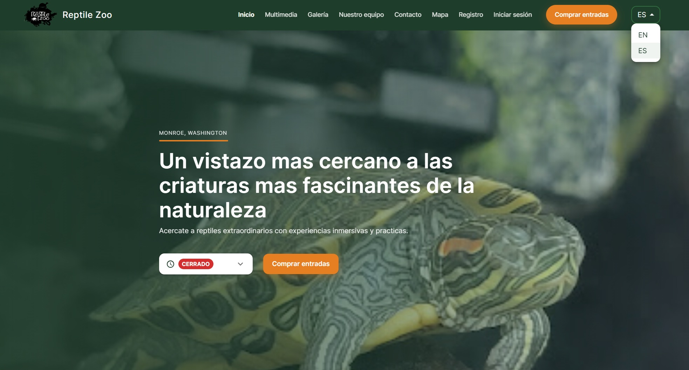
</a>
<a href="screenshots/public/FeaturedAttractionsSection.jpg">
  
</a>
<a href="screenshots/public/CustomerHighlights.jpg">
  
</a>
<a href="screenshots/public/Media.jpg">
  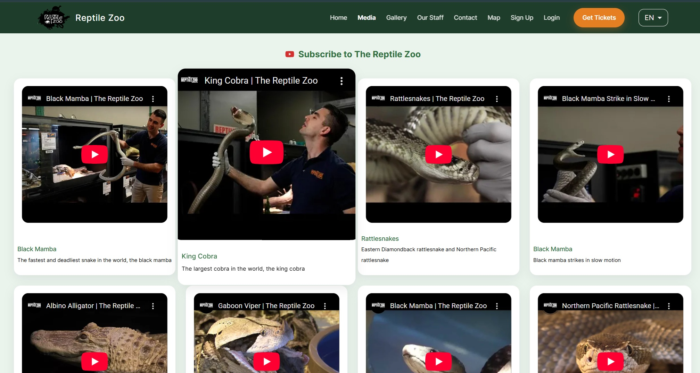
</a>
<a href="screenshots/public/Gallery.jpg">
  
</a>
<a href="screenshots/public/StaffDirectory.jpg">
  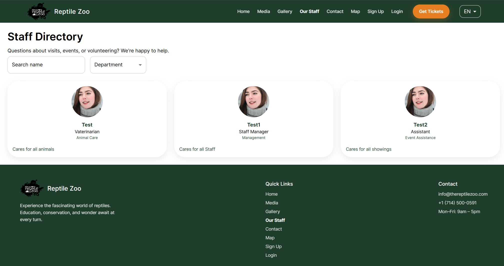
</a>
<a href="screenshots/public/Map.jpg">
  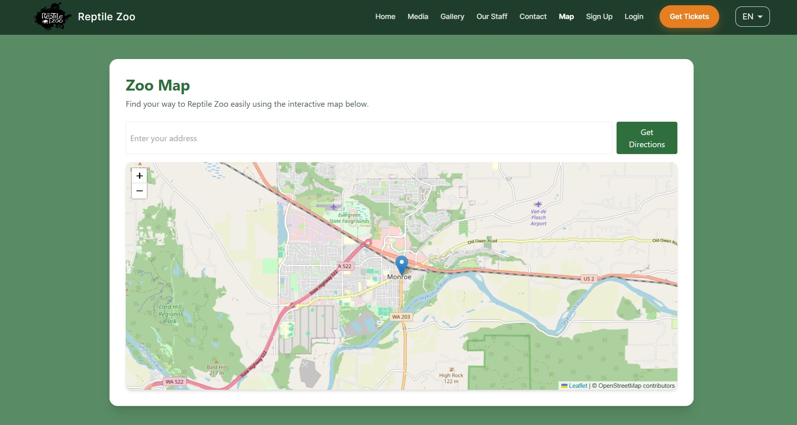
</a>
<a href="screenshots/public/ContactUs.jpg">
  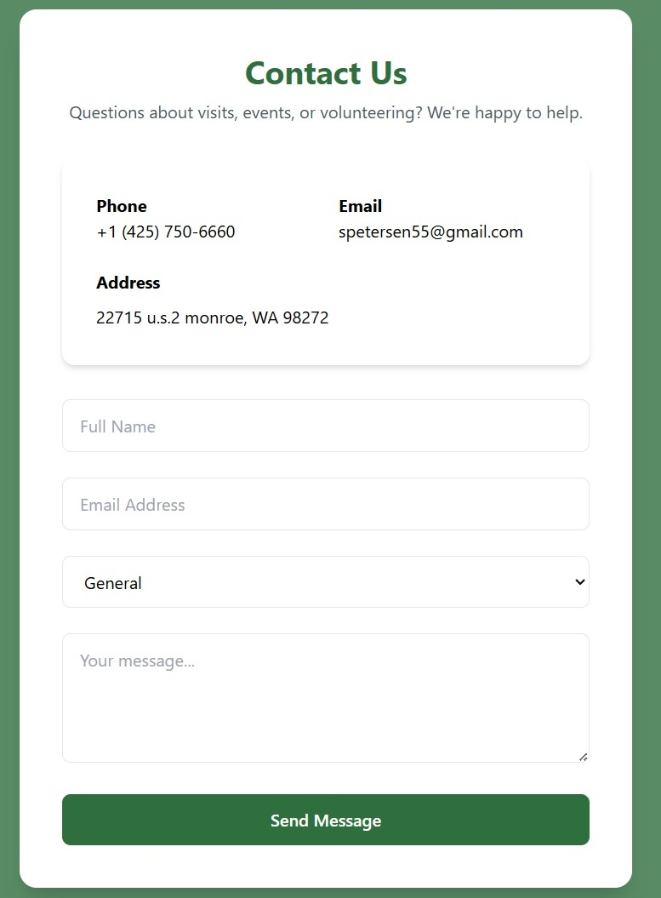
</a>
<a href="screenshots/public/SignUp.jpg">
  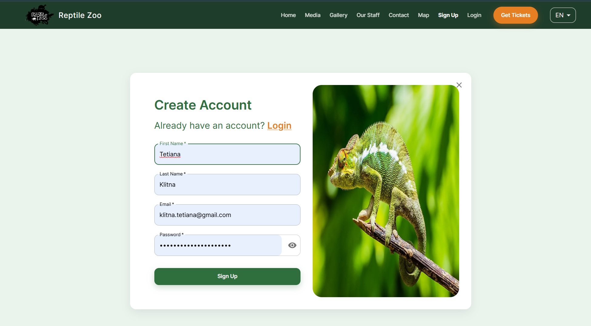
</a>
<a href="screenshots/public/Login.jpg">
  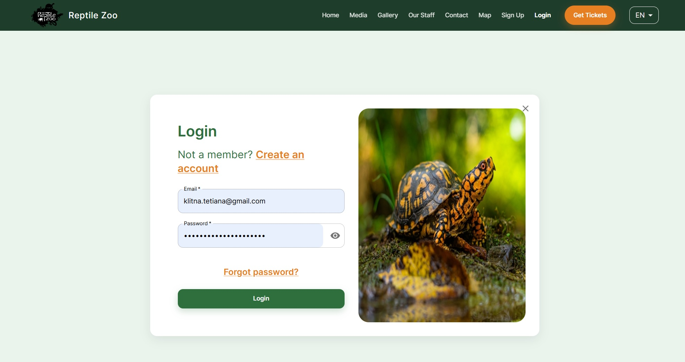
</a>
<a href="screenshots/public/ForgotPassword.jpg">
  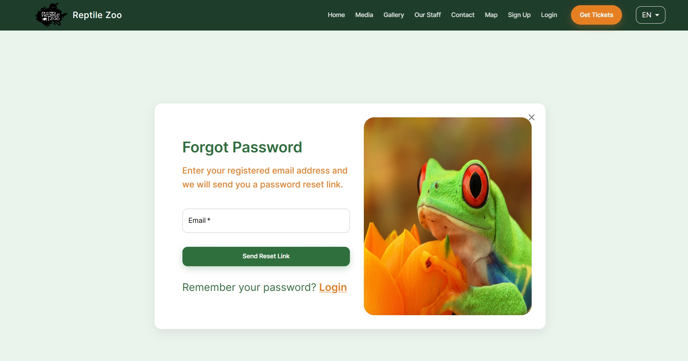
</a>
<a href="screenshots/public/PaymentPage.jpg">
  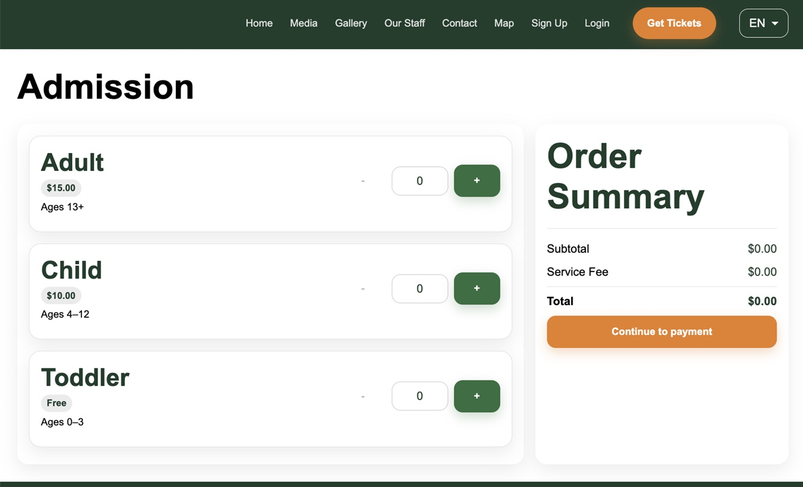
</a>
<a href="screenshots/public/StripePayment.jpg">
  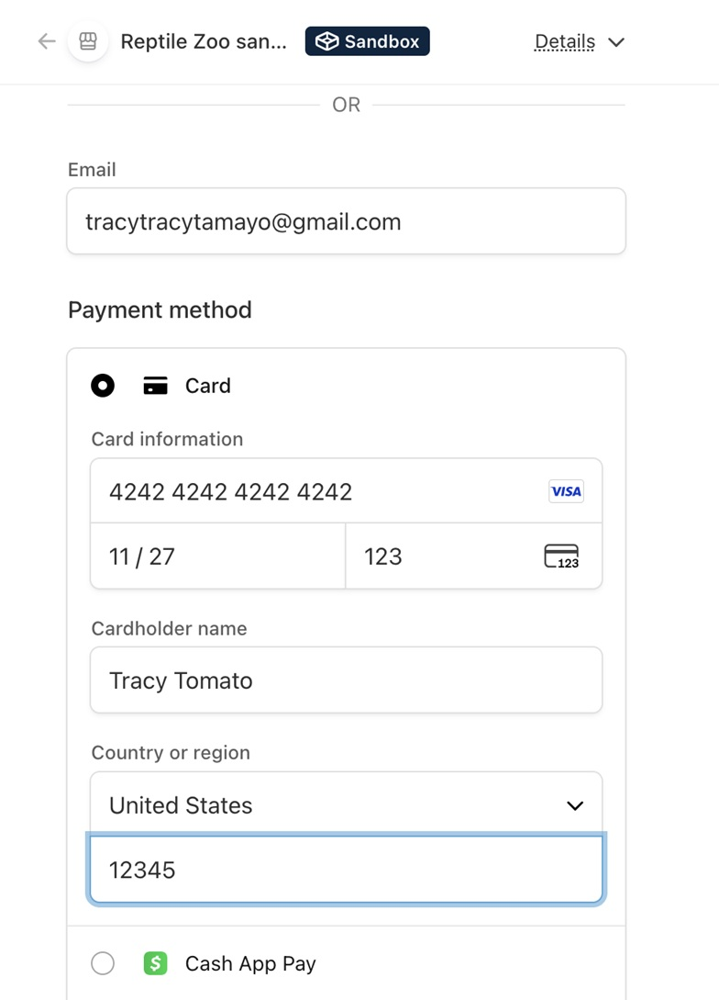
</a>
<a href="screenshots/public/PaymentSuccess.jpg">
  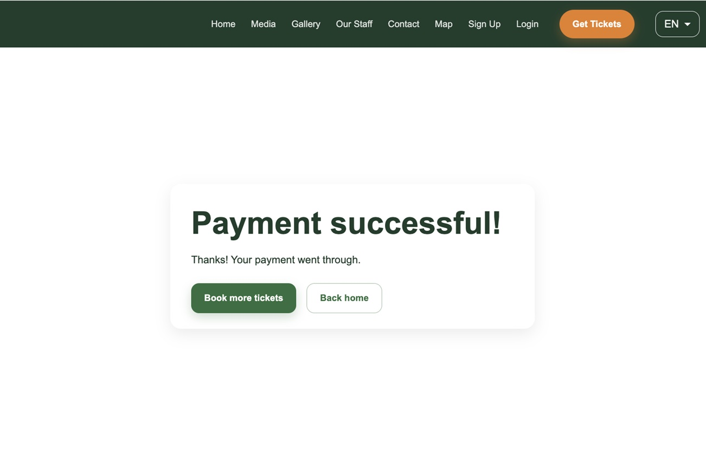
</a>

### 🔐 Protected Logged-In User Pages
<a href="screenshots/user/Calendar.jpg">
  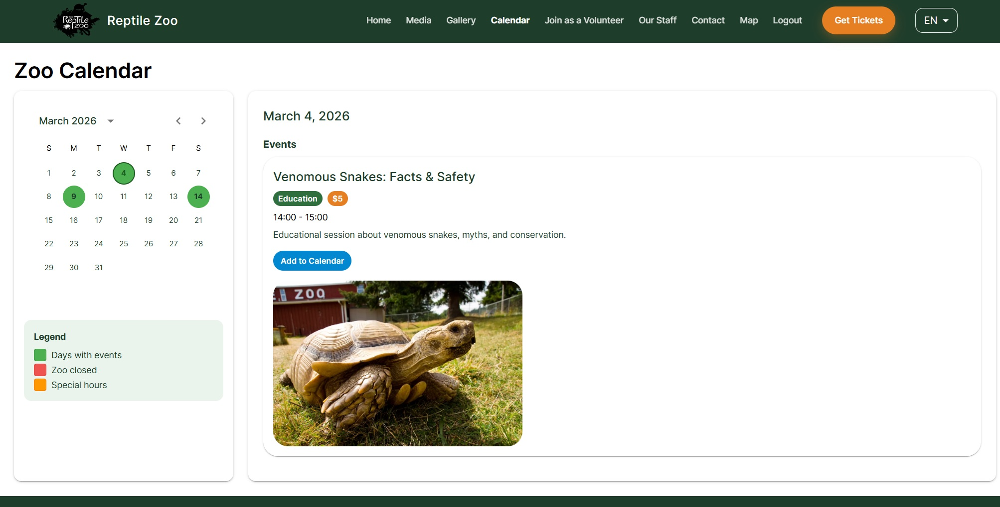
</a>
<a href="screenshots/user/JoinAsVolunteer.jpg">
  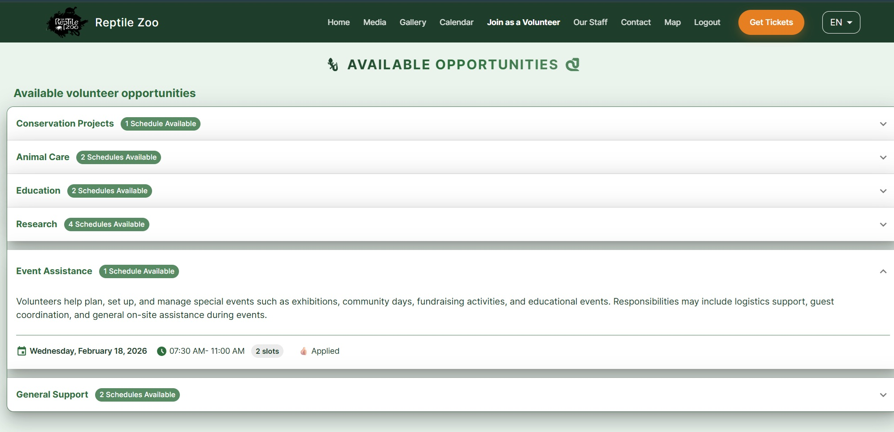
</a>
<a href="screenshots/user/AppliedSchedules.jpg">
  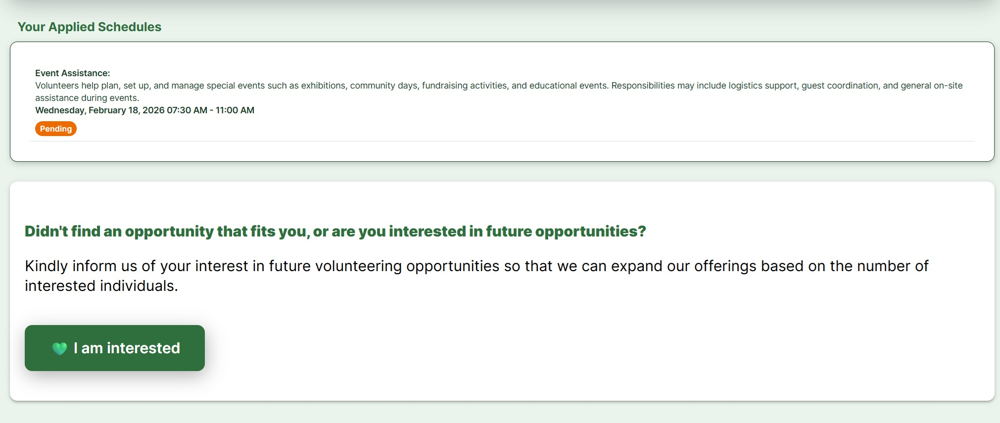
</a>

### 🛡️ Protected Admin Pages
<a href="screenshots/admin/ManageGallery.jpg">
  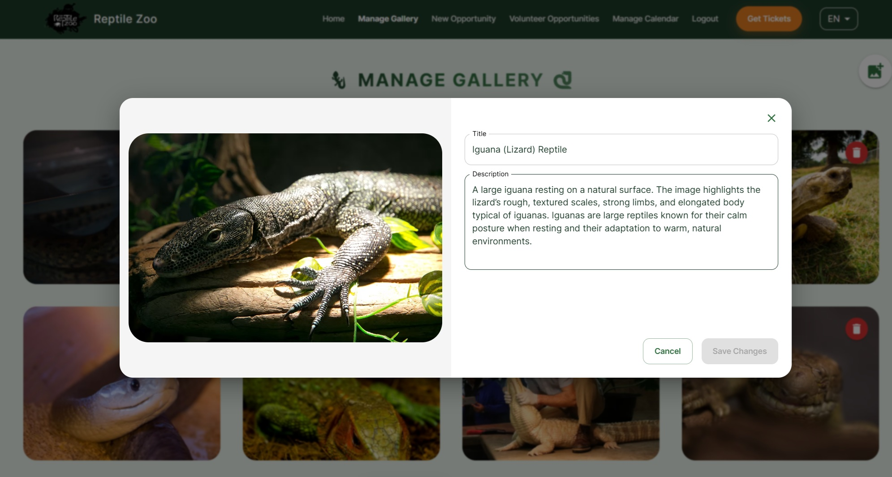
</a>
<a href="screenshots/admin/NewVolunteeringOpportunity.jpg">
  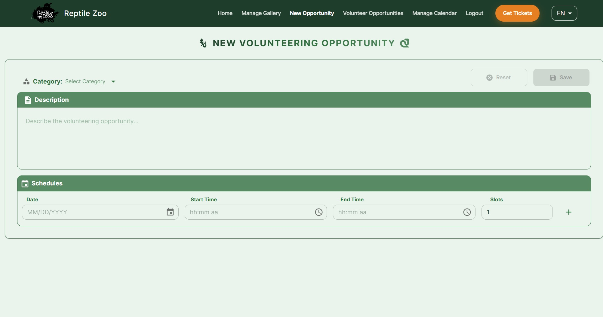
</a>
<a href="screenshots/admin/VolunteeringOpportunities.jpg">
  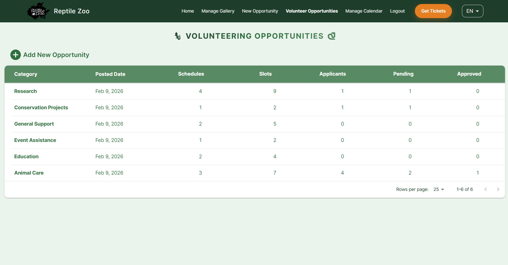
</a>
<a href="screenshots/admin/ManageCalendar.jpg">
  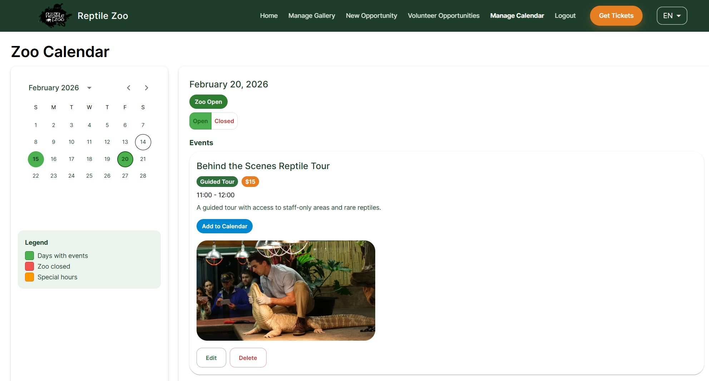
</a>

## 🛠 Tech Stack

### Frontend
- React 19 + TypeScript
- Vite
- React Router
- MUI (Material UI, MUI X Date Pickers)
- Day.js
- Axios
- i18next (internationalization)
- Leaflet (maps)
- Tailwind CSS

### Backend
- Node.js + Express.js (REST API)
- Stripe (payments)
- JWT authentication
- Multer + Cloudinary (uploads)
- Nodemailer

### Database
- MongoDB + Mongoose

### Tooling
- Git & GitHub & Actions GitHub
- dotenv (environment variables)
- ESLint / Prettier

## 🎨 Design System 🐍

### Color Palette
- **Primary Green**: <span style="color: #2F6F3E;">**#2F6F3E**</span> (Zoo Green)
- **Dark Green**: <span style="color: #1F3D2B;">**#1F3D2B**</span> (Zoo Dark)
- **Secondary Orange**: <span style="color: #E67E22;">**#E67E22**</span> (Zoo Orange)
- **Light Background**: <span style="color: #EAF4ED; background: #333; padding: 2px 4px;">**#EAF4ED**</span> (Zoo Light)
- **White**: <span style="background: #ddd; padding: 2px 4px;">**#FFFFFF**</span>
- **Black**: <span style="color: #000000;">**#000000**</span>

## 📁 Project Structure 🐊

#### Backend Structure
<a href="screenshots/ProjectStructureBackend.jpg">
  
</a>

#### Frontend Structure
<a href="screenshots/ProjectStructureFrontend.jpg">
  
</a>

## ⚙️ Setup & Installation

### Prerequisites
- Node.js (v18+ recommended)
- npm or yarn
- MongoDB or PostgreSQL (local or cloud)

### Backend Setup

```bash
cd backend
npm install
npm run dev
```

Create a `.env` file inside the `backend` folder:

```backend env
PORT=8080
MONGO_URI=<mongo_uri>
JWT_SECRET=<jwt_secret>
JWT_LIFETIME=<jwt_lifetime>
EMAIL_USER=<email_user>
EMAIL_PASS=<email_pass>
FRONTEND_URL=<frontend_url>
CLOUDINARY_CLOUD_NAME=<cloudinary_cloud_name>
CLOUDINARY_API_KEY=<cloudinary_api_key>
CLOUDINARY_API_SECRET=<cloudinary_api_secret>
STRIPE_SECRET_KEY=<stripe_secret_key>
```

Backend runs on:  
http://localhost:8080

### Frontend Setup

```bash
cd frontend
npm install
npm run dev
```
Create a `.env` file inside the `frontend` folder:
VITE_API_BASE_URL=<vite_api_base_url>

Frontend runs on:  
http://localhost:5173

## 🧪 Available Scripts

### Frontend
```bash
npm run dev
npm run build
npm run preview
```

### Backend
```bash
npm run dev
npm start
```

## 🔐 API Overview

### Endpoints

```text
# Public
POST   /api/v1/auth/register
POST   /api/v1/auth/login
POST   /api/v1/auth/forgot-password
POST   /api/v1/auth/reset-password/:token
GET    /api/v1/user/profile
PUT    /api/v1/user/profile
GET    /api/v1/calendar/opening-days
GET    /api/v1/calendar/events
GET    /api/v1/calendar/month-data
GET    /api/v1/business-hours
GET    /api/v1/business-hours/status
PUT    /api/v1/business-hours
GET    /api/v1/contact-info
POST   /api/v1/contact-messages
GET    /api/v1/contact-messages
GET    /api/v1/contact-messages/:id
DELETE /api/v1/contact-messages/:id
GET    /api/v1/images
POST   /api/v1/images/upload
PUT    /api/v1/images
DELETE /api/v1/images
GET    /api/v1/staff
GET    /api/v1/staff/:id
POST   /api/v1/staff
PUT    /api/v1/staff/:id
DELETE /api/v1/staff/:id
GET    /api/v1/checkout/ticket-types
POST   /api/v1/checkout/quote
POST   /api/v1/stripe/create-session
GET    /api/v1/volunteering/enums/categories
GET    /api/v1/volunteering/opportunities
GET    /api/v1/volunteering/opportunities/full
GET    /api/v1/volunteering/opportunities/applied
GET    /api/v1/volunteering/opportunities/:opportunityId/applicants
POST   /api/v1/volunteering/new
POST   /api/v1/volunteering/opportunity/addApplicant
PATCH  /api/v1/volunteering/opportunity/applicant/status

# Admin
GET    /api/v1/admin/events
POST   /api/v1/admin/events
PUT    /api/v1/admin/events/:id
DELETE /api/v1/admin/events/:id
POST   /api/v1/admin/opening-days
PUT    /api/v1/admin/opening-days/:id
DELETE /api/v1/admin/opening-days/:id
GET    /api/v1/admin/users
PUT    /api/v1/admin/users/:id
DELETE /api/v1/admin/users/:id
```

## 🤝 Team & Collaboration

### Team Members
- Tracy Cano — Full Stack Developer [GitHub](https://github.com/trca831)
- Tetiana Klitna — Full Stack Developer [GitHub](https://github.com/TetianaKlitna/)
- Masouma Ahmadi — Full Stack Developer [GitHub](https://github.com/MASOUMA2023)
- Uma Sekar — Full Stack Developer [GitHub](https://github.com/umavenki)
- Maher Algepha — Full Stack Developer [GitHub](https://github.com/Maher-Algepah)

### Workflow
- GitHub Issues for task tracking
- Feature branches for development
- Pull Requests required for all merges
- Code reviews before merging to `dev`


## 🧩 Development Process

- Sprint planning with scoped MVP goals
- Backend-first API design and validation
- Parallel frontend integration with staged endpoints
- Incremental delivery with frequent demos and feedback

## 📌 Known Issues / Limitations

- No automated tests yet
- Performance optimizations pending

## 🛣 Future Improvements
- Add automated testing (Jest, Supertest)
- Improve security and validation
- Add caching and performance improvements
- Dockerize the application
- Add monitoring/logging (Sentry, structured logs)
- Accessibility audit and improvements

### Planned Features

- Event booking system
- Founder story page
- Virtual zoo tour

## 🙌 Acknowledgments

We sincerely thank Gina Castromonte, Node CIL Leader. She helped us run clear, productive meetings, kept the team focused and motivated, and guided us through challenges as we grew as developers.

We are also grateful to Code the Dream for real-world experience, strong technical support, and the confidence to move forward in our tech careers.

## 📄 License

This project is for educational purposes only.